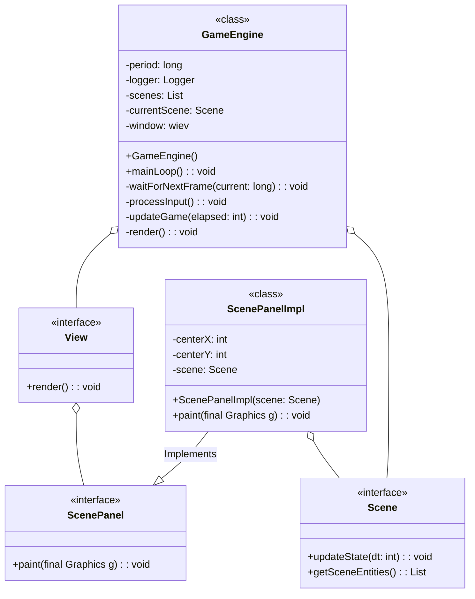
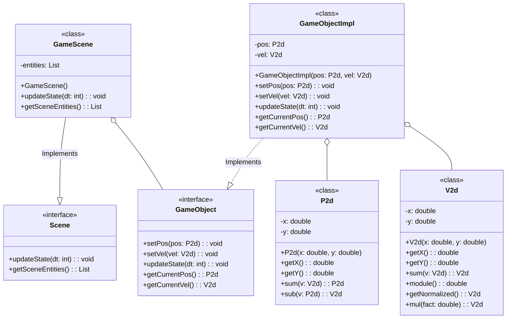

```mermaid
classDiagram

class GameEngine {
  <<class>>
  -period: long
  -logger: Logger
  -scenes: List<Scene>
  -currentScene: Scene
  -window: wiev
  +GameEngine()
  +mainLoop(): void
  -waitForNextFrame(current: long): void
  -processInput(): void
  -updateGame(elapsed: int): void
  -render(): void
}


class Scene {
  <<interface>>
  +updateState(dt: int): void
  +getSceneEntities(): List<GameObject>
}


class ScenePanel{
  <<interface>>
  +paint(final Graphics g): void
}

class ScenePanelImpl{
  <<class>>
  -centerX: int
  -centerY: int
  -scene: Scene
  +ScenePanelImpl(scene: Scene)
  +paint(final Graphics g): void
}


class View {
  <<interface>>
  +render(): void
}


GameEngine o-- View
GameEngine o-- Scene

ScenePanelImpl --|> ScenePanel : Implements
ScenePanelImpl o-- Scene
View o-- ScenePanel


```

```mermaid
classDiagram

class Scene {
  <<interface>>
  +updateState(dt: int): void
  +getSceneEntities(): List<GameObject>
}

class GameScene {
  <<class>>
  -entities: List<GameObject>
  +GameScene()
  +updateState(dt: int): void
  +getSceneEntities(): List<GameObject>
}


class GameObject {
  <<interface>>
  +setPos(pos: P2d): void
  +setVel(vel: V2d): void
  +updateState(dt: int): void
  +getCurrentPos(): P2d
  +getCurrentVel(): V2d
}

class GameObjectImpl {
  <<class>>
  -pos: P2d
  -vel: V2d
  +GameObjectImpl(pos: P2d, vel: V2d)
  +setPos(pos: P2d): void
  +setVel(vel: V2d): void
  +updateState(dt: int): void
  +getCurrentPos(): P2d
  +getCurrentVel(): V2d
}


class P2d {
  <<class>>
  -x: double
  -y: double
  +P2d(x: double, y: double)
  +getX(): double
  +getY(): double
  +sum(v: V2d): P2d
  +sub(v: P2d): V2d
}
class V2d {
  <<class>>
  -x: double
  -y: double
  +V2d(x: double, y: double)
  +getX(): double
  +getY(): double
  +sum(v: V2d): V2d
  +module(): double
  +getNormalized(): V2d
  +mul(fact: double): V2d
}


GameScene --|> Scene : Implements
GameScene o-- GameObject

GameObjectImpl ..|> GameObject : Implements

GameObjectImpl o-- P2d
GameObjectImpl o-- V2d

```