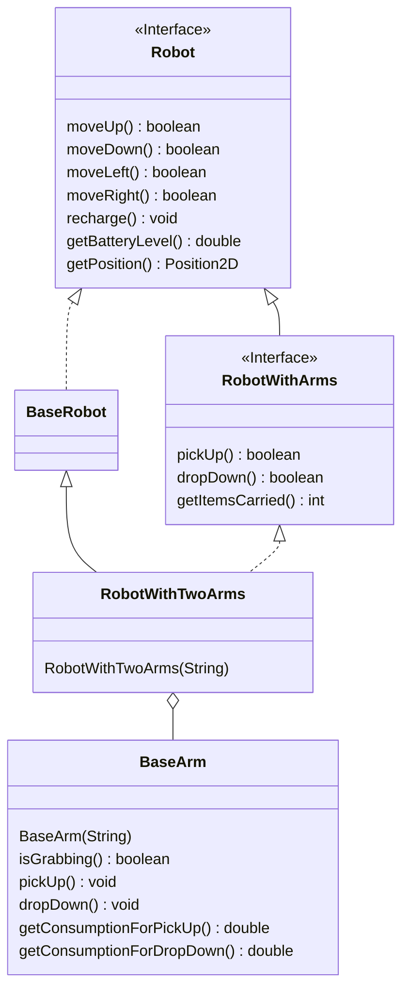

```mermaid
classDiagram

Robot <|.. BaseRobot

BaseRobot <|-- RobotWithTwoArms

Robot <|-- RobotWithArms

<<Interface>> Robot

<<Interface>> RobotWithArms

RobotWithArms <|.. RobotWithTwoArms

RobotWithTwoArms o-- BaseArm

class Robot {

moveUp() boolean

moveDown() boolean

moveLeft() boolean

moveRight() boolean

recharge() void

getBatteryLevel() double

getPosition() Position2D

}

class RobotWithArms {

pickUp() boolean

dropDown() boolean

getItemsCarried() int

}

class RobotWithTwoArms {

RobotWithTwoArms(String)

}

class BaseArm {

BaseArm(String)

isGrabbing() boolean

pickUp() void

dropDown() void

getConsumptionForPickUp() double

getConsumptionForDropDown() double

}
```